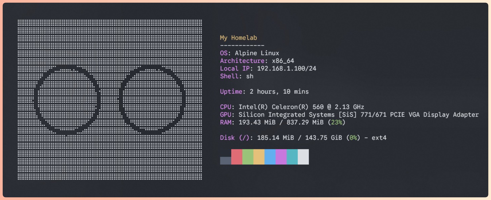

# My simple homelab

So, I am making this repo to share what I find while pushing an **Intel Celeron 560** with **1GB of DDR2 memory** to its absolute limits in 2026. I am starting this project in 2026 and will try to keep it as updated as possible.

## My laptop specs

## Why...

I've always wanted to try self-hosting things. I watch a lot of videos about it and I had this old Celeron laptop before getting my current PC, and it is in pretty bad shape physically. Instead of throwing it away, I wanted to put it to some good use and see what a truly low-spec machine can achieve as a homelab.
